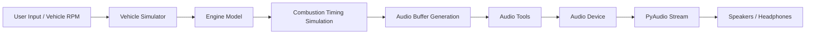

# 🚗 Engine Sound Simulator+++

A **Python engine sound synthesizer** capable of generating realistic engine audio using procedural synthesis, combustion samples, or live vehicle RPM data.

It can simulate engine acoustics through:

* 🔊 Synthetic waveform generation
* 💥 Combustion sample playback
* 📡 Real-time **OBD2 RPM data**

# 📝 Changelog

See [CHANGELOG.md](./CHANGELOG.md)

# ✨ Features

### 🔧 Refactored Codebase

The entire codebase has been **rewritten and refactored** to follow modern Python practices:

* Consistent naming conventions
* Type hints throughout
* Extensive inline documentation
* Modular architecture
* Improved maintainability

### 🔊 Multiple Engine Sound Modes

The simulator can generate engine sounds using different synthesis methods:

| Mode        | Description                                                      |
| ----------- | ---------------------------------------------------------------- |
| **pop**     | Uses a combustion sample (`pop.wav`) for realistic firing sounds |
| **sine**    | Generates sound using a sine waveform                            |
| **default** | Sawtooth synthesis combined with noise for richer audio          |

These modes are selectable in:

```
play_through_rpm_simulator.py
```

### 🚗 Vehicle RPM Simulation

A **vehicle drivetrain simulation** models:

* Gear ratios
* Throttle input
* Acceleration physics
* RPM changes
* Gear shifting

Keyboard controls allow interactive engine behavior.

### 📡 Live OBD2 Engine Audio

The simulator can generate **real-time engine sound based on vehicle RPM** using an **OBD2 interface**.

The system:

1. Connects to an OBD2 adapter
2. Reads engine RPM
3. Scales RPM to the simulated engine
4. Generates matching engine audio

Script:

```
play_through_vehicle_obd2.py
```

### 🔥 Procedural Engine Modeling

The engine model simulates:

* Cylinder firing order
* Combustion timing
* Engine strokes
* Unequal firing intervals
* Multi-cylinder configurations

The engine factory includes many presets such as:

* Inline engines
* V-twins
* V8 configuration  s
* Boxer engines
* Randomized engines
* Experimental rotary simulation

### 🎛 Exhaust Resonance Simulation

An optional convolution filter simulates **exhaust resonance**, producing a more natural and dynamic engine sound.

```
ENABLE_EXHAUST_RESONANCE = True
```

# 📂 Project Structure

```
engine-sound/
│
├─ core/
│  ├─ audio_device.py        # PyAudio playback wrapper
│  ├─ audio_tools.py         # Audio buffer utilities
│  ├─ configurations.py      # Audio configuration constants
│  ├─ controls.py            # Keyboard input handling
│  ├─ engine.py              # Core engine sound generator
│  ├─ engine_factory.py      # Predefined engine configurations
│  ├─ synthesisation.py      # Primitive waveform generation
│
├─ play_through_rpm_simulator.py
│   Interactive vehicle RPM simulation
│
├─ play_through_vehicle_obd2.py
│   Real-time engine sound from OBD2 RPM
│
├─ pop.wav                   # Combustion sample (used in pop mode)
│
└─ requirements.txt
```

# ⚙️ Requirements

* Python **3.9+**
* Functional audio playback device
* Optional: **OBD2 adapter** for live RPM mode

# 📦 Installation

Clone the repository:

```
git clone https://github.com/AceBurgundy/engine-sound-simulator
cd engine-sound-simulator
```

Install dependencies:

```
pip install -r requirements.txt
```

# ▶️ Usage

## 🏎 RPM Simulator Mode

Simulates a vehicle engine with keyboard controls.

```
python play_through_rpm_simulator.py
```

### 🎮 Controls

| Key   | Action    |
| ----- | --------- |
| ↑     | Throttle  |
| Q     | Upshift   |
| Space | Downshift |
| ESC   | Exit      |

## 📡 OBD2 Engine Mode

Generate engine sound from a **real vehicle’s RPM**.

```
python play_through_vehicle_obd2.py
```

Requirements:

* Compatible **OBD2 adapter**
* Correct COM port configured:

```python
connection = obd.OBD(portstr="COM3")
```

# 🔊 Engine Sound Generation

The simulator produces sound using **grain-based synthesis** and **engine cycle modeling**.

The system simulates:

1. Cylinder combustion events
2. Time between firing cycles
3. Engine stroke timing
4. Cylinder firing order

Each cylinder contributes a waveform which is combined into the final engine audio stream.

# 🧠 How the Engine Model Works

The engine simulation generates sound per **engine cycle**:

1. Compute time between cylinder fires
2. Slice combustion audio buffers
3. Align buffers based on firing order
4. Overlay buffers from all cylinders
5. Stream the result through PyAudio

This allows dynamic RPM changes while maintaining realistic engine acoustics.

# 🛠 Troubleshooting

### PyAudio installation issues

If PyAudio fails to install:

See this solution:

[https://stackoverflow.com/a/55630212/13015676](https://stackoverflow.com/a/55630212/13015676)

### No sound output

Check:

* Default system audio device
* PyAudio installation
* Correct sample rate configuration

### OBD2 connection issues

Verify:

* Correct COM port
* Adapter compatibility
* Vehicle ignition state

# 🏗 Architecture

The simulator is built using a **modular audio pipeline** where engine simulation, audio synthesis, and playback are separated into reusable components.



### Component Overview

| Module                          | Responsibility                                              |
| ------------------------------- | ----------------------------------------------------------- |
| `VehicleSimulator`              | Simulates vehicle RPM, gears, and throttle input            |
| `Engine`                        | Simulates cylinder firing and engine cycle timing           |
| `synthesisation`                | Generates primitive waveforms (sine, sawtooth, etc.)        |
| `audio_tools`                   | Audio processing utilities (normalization, slicing, mixing) |
| `AudioDevice`                   | PyAudio interface wrapper                                   |
| `play_through_rpm_simulator.py` | Interactive vehicle simulation                              |
| `play_through_vehicle_obd2.py`  | Real-time RPM input from vehicle                            |

# 🎮 Demo — RPM Simulator

The script:

```bash
python play_through_rpm_simulator.py
```

runs a **real-time interactive engine simulation**.

It models:

* throttle input
* engine RPM
* gear ratios
* simulated drivetrain behavior
* dynamic audio generation

## 🎧 What You'll Hear

The engine sound dynamically changes depending on:

* engine RPM
* gear changes
* throttle state
* cylinder firing rate

Different **sound synthesis modes** can also be selected inside the script.

## 🎮 Controls

| Key            | Action                      |
| -------------- | --------------------------- |
| ⬆ **Up Arrow** | Toggle throttle (0% ↔ 100%) |
| **Q**          | Upshift                     |
| **Space**      | Downshift                   |
| **ESC**        | Exit simulation             |

## Example Console Output

While running, the simulator prints live engine state:

```
RPM: 4321 | Gear: 3 | Throttle: 1.00
```

Values update continuously as you control the engine.

## Example Behavior

1️⃣ Start simulator
2️⃣ Press **Up Arrow** to apply throttle
3️⃣ RPM begins climbing
4️⃣ Press **Q** to shift up
5️⃣ Engine RPM drops slightly
6️⃣ Press **Space** to downshift

The audio output changes accordingly to simulate a **real engine acceleration cycle**.

# 🔊 Sound Generation Modes

Inside `play_through_rpm_simulator.py` you can select:

```python
ENGINE_SOUND_MODE = "pop"
```

Available modes:

| Mode      | Description                          |
| --------- | ------------------------------------ |
| `pop`     | Uses a combustion sample (`pop.wav`) |
| `sine`    | Continuous sine wave engine          |
| `default` | Sawtooth + noise hybrid waveform     |

# 🚀 Future Improvements (Optional Section)

Potential future additions:

* 🎚 Real-time parameter tuning
* 🚗 More engine presets
* 🔊 Advanced exhaust simulation
* 📊 RPM visualization
* 🎛 GUI interface


## Attribution

This project is derived from the original
Engine Sound Simulator created by [jgardner8](https://github.com/jgardner8).

Original repository:
[engine-sound-simulator](https://github.com/jgardner8/engine-sound-simulator)

The original project did not include a license.

The original author retains copyright over their
work included in this repository.

This fork introduces significant refactoring,
documentation, and improvements.

# 🚧 Work in Progress

Some experimental features are still under development:

* Rotary engine support
* Advanced exhaust modeling
* Additional engine presets
* Improved sound synthesis

# 📜 License

This project is licensed under the **Mozilla Public License 2.0 (MPL-2.0)**.

The MPL 2.0 is a **file-level copyleft license**, which means:

* You can **use, modify, and distribute** the software.
* Modified files must remain **open under MPL-2.0**.
* You may combine this code with **proprietary software**, as long as MPL-covered files remain open.

For the full license text, see the `LICENSE` file included in this repository.

You can also read the license online:
[https://www.mozilla.org/en-US/MPL/2.0/](https://www.mozilla.org/en-US/MPL/2.0/)
